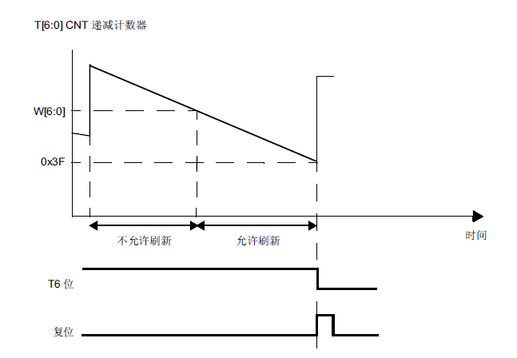

本篇将介绍SMT32的两个看门狗，独立看门狗和窗口看门狗。

# 独立看门狗（IWDG）

独立看门狗 (IWDG) 由其专用低速时钟 (LSI) 驱动，因此即便在主时钟发生故障时仍然保持 工作状态。窗口看门狗 (WWDG) 时钟由 APB1 时钟经预分频后提供，通过可配置的时间窗 口来检测应用程序非正常的过迟或过早的操作。IWDG 最适合应用于那些需要看门狗作为一个在主程序之外，能够完全独立工作，并且对时 间精度要求较低的场合。WWDG 最适合那些要求看门狗在精确计时窗口起作用的应用程序。

其基本原理在于，当通过对关键字寄存器 (IWDG_KR) 写入值 0xCCCC 启动独立看门狗时，计数器开始从复位值 0xFFF 递减计数。当计数器计数到终值 (0x000) 时会产生一个复位信号（IWDG 复位）。

需要注意的是，IWDG_PR 和IWDG_RLR 寄存器具有写保护功能。要修改这两个寄存器的值，必须先向IWDG_KR 寄存器中写入0x5555。将其他值写入这个寄存器将会打乱操作顺序，寄存器将重新被保护。重装载操作(即写入0xAAAA)也会启动写保护功能。

函数为：

```c
IWDG_WriteAccessCmd(IWDG_WriteAccess_Enable);
```

看门狗预分频系数设置函数：

```c
void IWDG_SetPrescaler(uint8_t IWDG_Prescaler); //设置IWDG 预分频值
```

预分频值这里可选 4~256，皆为2的指数。

设置看门狗的重装载值的函数是：

```c
void IWDG_SetReload(uint16_t Reload); //设置IWDG 重装载值
```

重载值可选 0~0x0FFF。

库函数里面重载计数值的函数:

```c
IWDG_ReloadCounter(); //按照IWDG 重装载寄存器的值重装载IWDG 计数器
```

启动看门狗函数：

```c
IWDG_Enable(); //使能IWDG
```

独立看门狗需要在重载时间之内重载。

## 独立看门狗时间计算

独立看门狗的超时周期由分频系数和重载值决定，该时间的计算方式为：

$$
T_{out} = (rlr \times pre)/T_{clk}
$$

其中，$T_{out}$为超时时间，$pre$为预分频值，$rlr$为预装载值。

一个STM32F4xx中文参考手册中的超时计算表格：

**表格 32 kHz (LSI) 频率条件下 IWDG 超时周期的最小值/最大值**

| 预分频器 | PR[2:0] 位 | 最短超时 (ms)<br />RL[11:0]= 0x000 | 最长超时 (ms)<br />RL[11:0]= 0xFFF |
| -------- | ---------- | ---------------------------------- | ---------------------------------- |
| /4       | 0          | 0.125                              | 512                                |
| /8       | 1          | 0.25                               | 1024                               |
| /16      | 2          | 0.5                                | 2048                               |
| /32      | 3          | 1                                  | 4096                               |
| /64      | 4          | 2                                  | 8192                               |
| /128     | 5          | 4                                  | 16384                              |
| /256     | 6          | 8                                  | 32768                              |


## 设置独立看门狗步骤

1. 取消寄存器写保护
2. 设置预分频系数和重装载值
3. 重载计数值喂狗（向IWDG_KR 写入0XAAAA）
4. 启动看门狗(向IWDG_KR 写入0XCCCC)

# 窗口看门狗（WWDG）

窗口看门狗通常被用来监测，由外部干扰或不可预见的逻辑条件造成的应用程序背离正常的运行序列而产生的软件故障。除非递减计数器的值在 T6 位变成 0 前被刷新，看门狗电路在 达到预置的时间周期时，会产生一个 MCU 复位。如果在递减计数器达到窗口寄存器值之前 刷新控制寄存器中的 7 位递减计数器值，也会产生 MCU 复位。这意味着必须在限定的时间 窗口内刷新计数器。

复位特性：

* 当递减计数器值小于 0x40 时复位（如果看门狗已激活）
* 在窗口之外重载递减计数器时复位（如果看门狗已激活）


